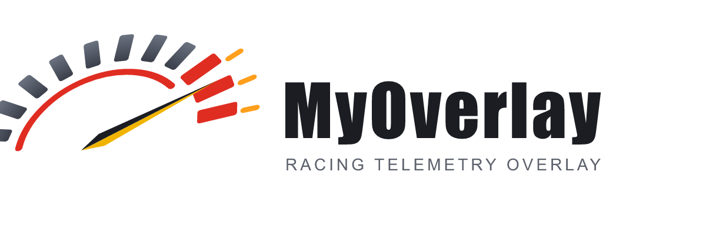

<p align="center">
  <picture>
    <source media="(prefers-color-scheme: dark)" srcset="assets/branding/png/logo-horizontal.png">
    
  </picture>
</p>

# media-tools

Zero-touch karting video pipeline: DJI Osmo Action / GoPro footage + AiM
MyChron telemetry in, YouTube videos with a telemetry overlay out. Cameras
are picked up as removable DCIM volumes (SD card / DJI over USB) or as MTP
portable devices (GoPro over USB, which mounts no drive letter).

```
camera SD/USB/MTP ──┐
                    ├─> ingest ─> correlate ─> sync ─> render ─> publish
MyChron (USB/WiFi) ─┘              (sessions)  (audio↔RPM)  (overlay)  (YouTube)
```

Every stage records its work in a per-track-day `session.json` manifest and
skips anything already done, so all commands are safe to re-run.

## Setup

1. Install [uv](https://docs.astral.sh/uv/) and [ffmpeg](https://ffmpeg.org/) (both on PATH).
2. `uv sync`
3. The repo ships `config.toml` with every option commented out at its
   default; it works untouched. Uncomment a line only to change it, e.g.:
   - `library_root` — where processed track days live (default `~/MyOverlay/render`)
   - `telemetry.data_dirs` — where downloaded MyChron sessions are kept
   - timezones if your camera/logger clocks aren't on system local time
4. For YouTube uploads: create a project in Google Cloud Console, enable the
   *YouTube Data API v3*, create a **Desktop** OAuth client, save the JSON as
   `client_secret.json` in the repo, **publish** the OAuth consent screen
   (otherwise the token expires weekly), then run `MyOverlay publish --dry-run`
   once and complete the browser authorization. `MyOverlay google-setup`
   automates all of this; the manual procedure is detailed in
   [docs/google-manual-setup.md](docs/google-manual-setup.md).

## Usage

All commands run through the `MyOverlay` executable (`dist/MyOverlay/MyOverlay.exe`).
The full command reference — every command and option — is auto-generated in
**[docs/CLI.md](docs/CLI.md)**. The day-to-day entry points:

```
MyOverlay run                # full chain: ingest -> correlate -> sync -> render
MyOverlay run --publish      # ... and upload to YouTube
MyOverlay status             # pipeline state of every track day
```

The exe self-updates from this repo and bundles git + ffmpeg, so friends need
nothing installed. To run it against a **local checkout** instead of its own
managed clone (e.g. your dev repo), set `MYOVERLAY_REPO=<path to this repo>`
and `MYOVERLAY_NO_UPDATE=1` — then it uses that checkout's code + `config.toml`.
(For development in this checkout, `uv run mt <command>` is the equivalent
entry point; see [Development](#development).)

### Zero-touch mode

```
MyOverlay watch              # poll for new material and run the pipeline (renders too)
MyOverlay watch --install    # auto-start the watcher at logon (launches via the exe)
```

With the watcher running the only human actions per track day are physical:
plug in the camera (or its SD card) and have the MyChron plugged in over USB
or in WiFi range. With `[telemetry] auto_download = true` the watcher also
pulls new sessions off the MyChron periodically, speaking AiM's own protocol
directly — no AiM software involved.

### Sync

Clips are aligned to telemetry by cross-correlating the engine sound
(loudness + dominant firing frequency) against the logged RPM trace. Each
sync gets a confidence score; clips below `render.min_sync_confidence` are
not rendered. Escape hatch:

```
MyOverlay sync 2026-07-12 --clip DJI_0042.MP4 --video-start "2026-07-12T13:05:02.30+00:00"
```

Solved clips seed the rest of the day (camera clock drift is stable within a
track day).

## Notes & limitations

- **YouTube uploads land private**: the API locks uploads from projects that
  haven't passed Google's (free) compliance audit. Pass the audit and set
  `youtube.privacy = "public"` if you ever want auto-public uploads.
- **DJI Action 5 Pro has no GPS/API** — hence audio sync and SD-card ingestion.
- **GoPro over USB must be in MTP mode**: on the camera, swipe down →
  Preferences → Connections → USB Connection → **MTP** (not "GoPro Connect").
  In MTP mode Windows shows the camera as a portable device and the pipeline
  finds its DCIM videos; in "GoPro Connect" mode nothing is visible to it.
  Alternatively pop the SD card into a reader — it mounts as a normal DCIM
  volume, no camera setting involved.
- **MyChron downloads need no AiM software**: the client speaks the logger's
  own protocol over USB or WiFi (see
  [docs/mychron-protocol-re.md](docs/mychron-protocol-re.md)). Only the
  MyChron6 is implemented; other AiM models use different download paths.
- **Picking a logger over WiFi**: USB is tried first. Falling back to WiFi,
  every `AiM-...` network in range is listed and — when there is more than
  one — you are asked which to join, every time, so a neighbour's logger is
  never picked for you. A password is asked for only if that network has one,
  then kept per-SSID, encrypted with Windows DPAPI, in
  `~/MyOverlay/wifi-credentials.json`. Both prompts need a terminal: with two
  loggers in range the watcher reports what it needs rather than guessing.
- The `.xrk` parser (`libxrk`) reads GPS, RPM, temperatures and lap markers;
  the session's absolute start time comes from the file's `Log Date`/`Log
  Time` metadata interpreted in `telemetry.timezone`.

## Development

For development in this checkout, `uv run mt <command>` is the direct entry
point (same CLI the exe forwards to), and `uv run python tools/proof_slices.py`
renders quick HD test slices instead of full re-renders.

To exercise a branch against the real library and Google credentials, run
`.\mt <command>` from the root of the checkout (or worktree) you are working
in. It runs that checkout's code — uncommitted edits included — with the
working directory and bundled ffmpeg/git the installed exe uses, so nothing
about the installed `mt` changes. `uv run mt` differs only in reading
`config.toml` from the checkout instead of `~\MyOverlay`.

```
uv run pytest
```

Tests cover each stage including an end-to-end render against a generated
test clip (requires ffmpeg). Sync correlation is tested against synthesized
engine audio with a known offset. To rebuild the shareable exe after adding a
new dependency: `powershell -File packaging/build_exe.ps1`.

After changing any CLI command or option, run `uv run mt docs` to regenerate
[docs/CLI.md](docs/CLI.md) — a test fails if it is stale.

## License

Copyright (C) 2026 Rodrigo Brim

This program is free software: you can redistribute it and/or modify it under
the terms of the GNU General Public License as published by the Free Software
Foundation, either version 3 of the License, or (at your option) any later
version. It is distributed in the hope that it will be useful, but WITHOUT ANY
WARRANTY; without even the implied warranty of MERCHANTABILITY or FITNESS FOR A
PARTICULAR PURPOSE. See [LICENSE](LICENSE) for the full text.

The shareable exe bundles two separate programs, invoked as subprocesses and
redistributed under their own terms: [MinGit](https://github.com/git-for-windows/git)
(GPL-2.0) and [ffmpeg](https://www.gyan.dev/ffmpeg/builds/) (GPL-3.0 in the
bundled `release-essentials` build).
